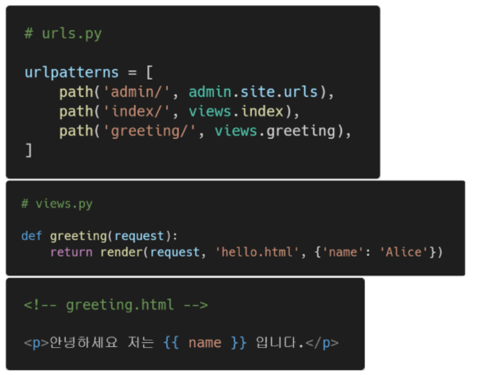

# django만을 사용해서 backend & frontend 모두 사용

### 목차

```
0. MVT Pattern
1. Templates
2. Templates 상속
```

### 0. MVT Pattern

* Model : 데이터의 구조를 정의, 데이터베이스의 기록을 관리(CUD)
* Template : 파일의 구조나 레이아웃 정의, 실제 내용을 보여주는데 사용
* View : HTTP요청을 수신하고 응답, Model을 통해 요청을 충족하는 데이터에 접근, template을 통해 응답


### 1. Templates

* 실제 내용을 보여주는데 사용되는 파일
* 파일의 구조 및 레이아웃을 정의(HTML)
* Templates 파일 경로의 기본 값은 app/templates 로 지정 / 편의를 위해 app/templates/app 으로 사용
* DTL(Django Template Language) : django template에서 사용하는 내장 함수
  * Variable(변수) : {{ variable }}
    * views에서 render()의 3번째 인자로 정의한 변수를 templates에서 사용
      * {'key': value} 형태의 딕셔너리
      * render(request, 출력할 템플릿 경로, 넘겨줄 변수)
    * 템플릿에서 {{ key }}형태로 사용
  * Filters(변수를 수정) : {{ variable|filter }}
    * 60여 개의 내장 필터 사용 가능
      * 변수를 모두 소문자로 출력 : {{ variable|lower }}
  * Tags(반복이나 논리 표현) : 
    * 조건문 :  
    * 반복문 :  
  * Comments(주석) : {# Comments #}



### 2. Templates 상속

* 코드의 재사용을 위해 사이트의 공통요소(부모 템플릿)를 포함시켜 일부(하위 템플릿)만 수정하도록 함

1) 공용 템플릿 설정

   ```
   ## PJT/settings.py
   TEMPLATES = [
   	{
   		...
   		'DIRS': [BASE_DIR / 'templates'],			# 굳이 templates가 아니어도 됨(폴더명)
   		...
   	}
   ]
   ```

2) 공용 템플릿 작성

   ```
   ## ./templates/base.html							# base_dir위치에 templates폴더 생성
   <!DOCTYPE html>
   <html>
   	<head>
   		...
   	</head>
   	<body>
   		<nav ~~~ />									# 재사용될 부분
   		<div class="container">
   									# 갈아 끼워질 부분
   			
   		</div>
   	</body>
   </html>
   ```

3) 하위 템플릿 작성

   ```
   ## app/templates/app/index.html
   							# 공용 템플릿 소환
   									# content라는 이름의 블록을 수정
   	<p>{{ name }}, 안녕하세요.</p>
   
   ```

   


