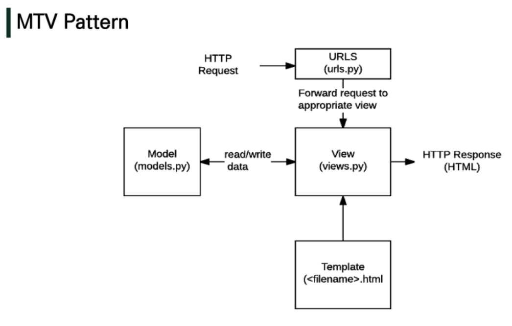

# django만을 사용해서 backend & frontend 모두 사용

### 목차

```
```

MVT Pattern

* Model : 데이터의 구조를 정의, 데이터베이스의 기록을 관리(CUD)
* Template : 파일의 구조나 레이아웃 정의, 실제 내용을 보여주는데 사용
* View : HTTP요청을 수신하고 응답, Model을 통해 요청을 충족하는 데이터에 접근, template을 통해 응답


